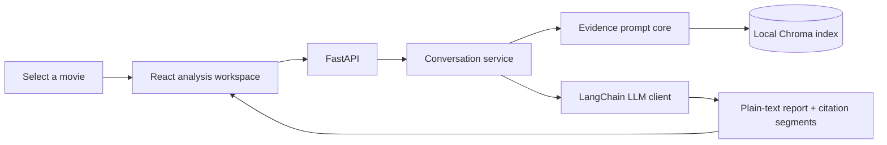

<div align="center">

# Movie Review Divergence Agent

**Turn an IMDb/Douban rating gap into an evidence-grounded explanation.**

[](https://www.python.org/)
[](https://fastapi.tiangolo.com/)
[](https://www.langchain.com/)
[](https://www.trychroma.com/)
[](https://react.dev/)

Explore rating gaps · Read grounded reports · Inspect the evidence · Ask focused follow-ups

</div>


## Why This Exists

A rating gap tells us that two audiences reacted differently. It does not tell
us **what they disagreed about**, whether the difference is a real clash of
viewpoints, or simply a difference in scoring severity.

Movie Review Divergence Agent turns that gap into an explanation. For a
selected movie, it loads the complete set of offline-selected IMDb and Douban
evidence, generates a report grounded only in those reviews, and lets the user
inspect or question the sources behind each claim.

> The runtime does not search for convenient reviews or invent cultural causes.
> It explains only what the fixed evidence set can support.

## From Rating Gap to Explanation

| Step | User experience | Evidence behavior |
| --- | --- | --- |
| **1. Discover** | Browse and sort movies by their cross-platform rating gap. | The movie catalog identifies where disagreement may be worth examining. |
| **2. Explain** | Generate a concise Chinese or English divergence report. | Every claim is constrained to the selected movie's Chroma evidence. |
| **3. Explore** | Open source popovers or ask up to five focused follow-ups. | Follow-ups remain inside the same evidence set and conversation session. |

The result is a report that stays readable for a movie audience while retaining
an inspectable path back to the original reviews.


## What You Can Explore

- **Real disagreement versus rating severity:** distinguish opposing viewpoints
  from cases where both sides notice the same weakness but score it differently.
- **Evidence behind the summary:** open citation popovers without exposing raw
  internal reference syntax in the report.
- **Bounded conversation:** ask focused questions without allowing the agent to
  drift into another movie or outside knowledge.
- **Independent bilingual sessions:** switch between Chinese and English
  reports without mixing their conversation history.

## How the Evidence Stays Grounded

The runtime is intentionally narrow. Selecting a movie fixes the evidence set;
the service then manages the grounded report and its limited follow-up
conversation.



This separation keeps evidence retrieval deterministic while allowing the LLM
and session store to be replaced independently.

<details>
<summary><strong>Component responsibilities</strong></summary>

- `MovieEvidencePromptCore` loads every stored evidence document for the
  selected movie and builds the grounded prompt.
- `MovieConversationService` coordinates language-specific reports and
  follow-up turns.
- `ConversationPolicy` validates evidence focus and limits each report to five
  follow-ups.
- `InMemoryConversationStore` owns expiring server-side sessions and can later
  be replaced with Redis.
- The frontend renders structured answer segments and evidence popovers instead
  of parsing raw citation labels.

</details>

## Run Locally

**Requirements:** Python 3.11 or newer and Node.js 20.19 or newer.

1. Create the local OpenAI configuration:

   ```bash
   cp config/openai.example.yml config/openai.yml
   ```

2. Install dependencies:

   ```bash
   pip install -r requirements.txt
   cd frontend && npm install && cd ..
   ```

3. Place `selected_movies.csv` and the local Chroma evidence directory where
   the committed manifest expects them. These private data files stay ignored.

4. Start the API and frontend in separate terminals:

   ```bash
   python scripts/run_api.py
   ```

   ```bash
   cd frontend
   npm run dev -- --host 127.0.0.1
   ```

Open [http://127.0.0.1:5173](http://127.0.0.1:5173).

Check frontend types with `cd frontend && npm run typecheck`. A production
build runs the same check automatically through `npm run build`.

## API Surface

| Method | Endpoint | Purpose |
| --- | --- | --- |
| `GET` | `/movies` | Browse and search the local movie catalog. |
| `GET` | `/movie/{imdb_id}/poster` | Resolve a movie poster from IMDb. |
| `POST` | `/movie/{movie_key}/analysis` | Create a grounded analysis session. |
| `POST` | `/analysis/{session_id}/messages` | Ask a bounded follow-up question. |
| `DELETE` | `/analysis/{session_id}` | Remove an active analysis session. |

Follow-up questions are limited to 200 characters and may focus on up to four
evidence references from the current report.

## Data Boundary

Credentials, local movie data, generated evidence indexes, dependency
directories, and build outputs are intentionally excluded from Git. The
committed manifest defines the Chroma collection contract used by the runtime.

<details>
<summary><strong>Project layout</strong></summary>

```text
app/
├── agent/          # Chroma evidence extraction and prompt construction
├── chat/           # Citation parsing, LLM adapter, policy, service, and store
├── movies.py       # Movie catalog loading, filtering, and sorting
├── posters.py      # IMDb poster lookup and HTML/JSON-LD fallback
└── api.py          # Thin HTTP routes and response contracts
frontend/
└── src/
    ├── api.ts      # Typed frontend API client
    └── components/ # Catalog visuals, analysis modal, report, and popovers
scripts/            # API runner and prompt inspection entry point
config/             # Safe local configuration template
divergence_evidence_artifacts/
└── chroma_divergence_evidence_manifest.json
```

</details>
