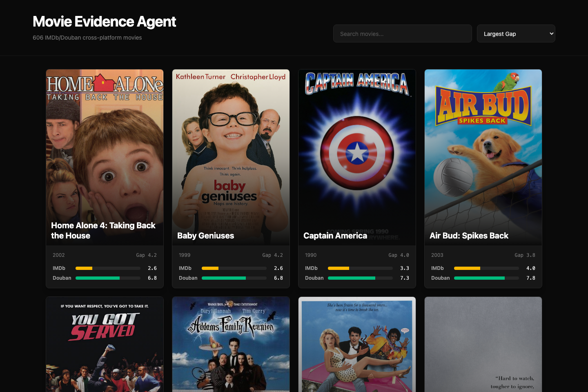
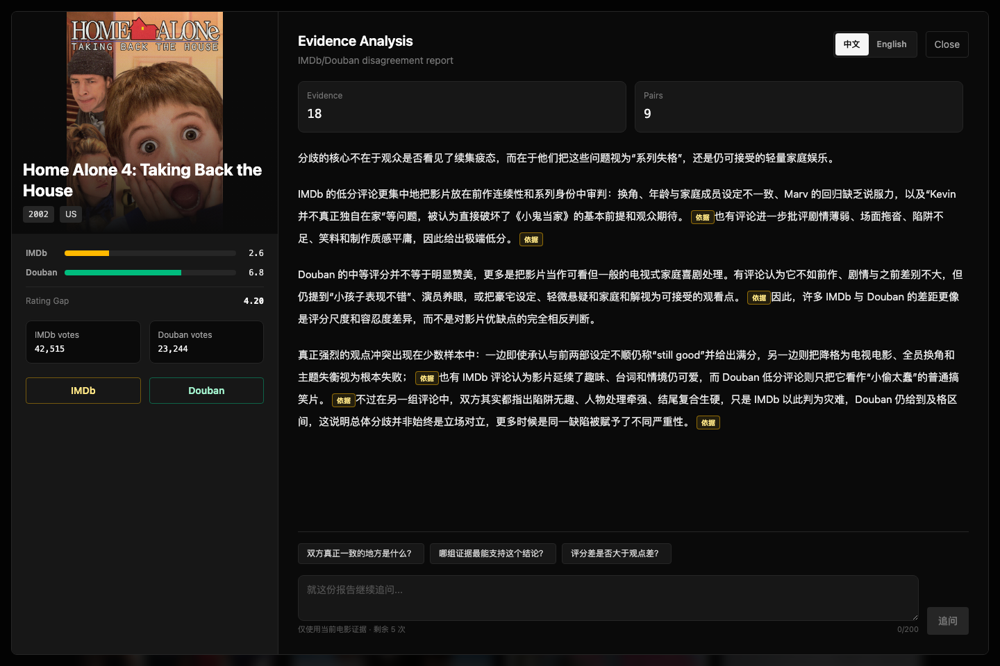
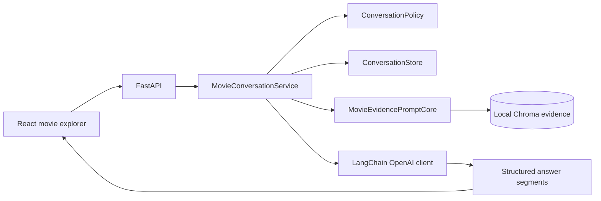

<div align="center">

# Movie Review Divergence Agent

**Turn IMDb and Douban rating gaps into evidence-grounded, explorable analysis.**

[](https://www.python.org/)
[](https://fastapi.tiangolo.com/)
[](https://www.langchain.com/)
[](https://www.trychroma.com/)
[](https://react.dev/)

</div>



## What It Does

Movie Review Divergence Agent explains **why the same movie is judged
differently on IMDb and Douban**. It retrieves the complete, offline-selected
evidence for one movie, asks an LLM to synthesize only that evidence, and turns
citations into source popovers that users can inspect and question.

| Experience | How it works |
| --- | --- |
| Compare platforms | Browse movies ranked by their IMDb/Douban rating gap. |
| Generate grounded reports | Analyze only the evidence stored for the selected movie. |
| Inspect sources | Open citation popovers without exposing internal reference syntax. |
| Continue the conversation | Ask up to five focused follow-up questions per report. |
| Switch languages | Maintain independent Chinese and English analysis sessions. |

## Product Experience

The report view keeps the movie context, platform ratings, evidence-backed
analysis, source actions, and bounded follow-up conversation in one workspace.



## Architecture



- `MovieEvidencePromptCore` performs one job: selected movie to complete Chroma
  evidence to grounded prompt.
- `MovieConversationService` coordinates language-specific reports and
  follow-up turns.
- `ConversationPolicy` validates evidence focus and limits each report to five
  follow-ups.
- `InMemoryConversationStore` owns expiring server-side sessions and can be
  replaced without changing the agent core.
- The frontend renders structured answer segments and evidence popovers instead
  of parsing raw citation labels.

## Quick Start

**Requirements:** Python 3.11 or newer and Node.js 20.19 or newer.

1. Create the local OpenAI configuration:

   ```bash
   cp config/openai.example.yml config/openai.yml
   ```

2. Install the backend dependencies:

   ```bash
   pip install -r requirements.txt
   ```

3. Install the frontend dependencies:

   ```bash
   cd frontend
   npm install
   cd ..
   ```

4. Provide the local movie catalog and Chroma evidence assets expected by the
   API and committed manifest.

5. Start the API and frontend in separate terminals:

   ```bash
   python scripts/run_api.py
   ```

   ```bash
   cd frontend
   npm run dev -- --host 127.0.0.1
   ```

Open [http://127.0.0.1:5173](http://127.0.0.1:5173).

## Conversation API

| Method | Endpoint | Purpose |
| --- | --- | --- |
| `GET` | `/movies` | Browse and search the local movie catalog. |
| `GET` | `/movie/{imdb_id}/poster` | Resolve a movie poster from IMDb. |
| `POST` | `/movie/{movie_key}/analysis` | Create a grounded analysis session. |
| `POST` | `/analysis/{session_id}/messages` | Ask a bounded follow-up question. |
| `DELETE` | `/analysis/{session_id}` | Remove an active analysis session. |

Follow-up questions are limited to 200 characters and may focus on up to four
evidence references from the current report.

## Project Layout

```text
app/
├── agent/          # Chroma evidence extraction and prompt construction
├── chat/           # LLM adapter, policy, sessions, service, and store
└── api.py          # Movie, poster, analysis, and follow-up endpoints
frontend/
└── src/            # React movie explorer and analysis workspace
scripts/            # API, terminal chat, and prompt inspection entry points
config/             # Safe local configuration template
divergence_evidence_artifacts/
└── chroma_divergence_evidence_manifest.json
```

## Local Assets

Credentials, local movie data, generated evidence indexes, dependency
directories, and build/cache outputs are intentionally excluded from Git.
The committed manifest defines the Chroma collection contract used by the
runtime.

## Build

```bash
cd frontend
npm run build
```
