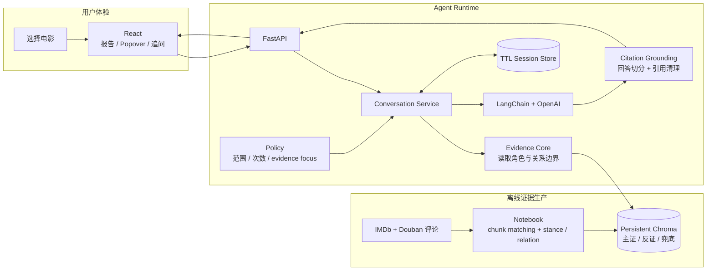

# Movie Review Divergence Agent 架构讲解

这份文档面向项目讲解，不承担 README 的产品介绍职责。

## 一句话定位

这是一个 **fixed-evidence analysis agent**：

用户先选择电影，系统再按 `movie_key` 取出 Notebook 写入 Chroma
的固定证据集。证据包含主分歧、反证与覆盖兜底三种角色；Runtime 根据
这些边界生成分析，并把回答中的内部引用转换成可查看原评论的
Evidence Popover。

它不是一个根据用户问题临时搜索评论的通用 RAG，也不是一个能自由调用工具的
开放式 Agent。

## 主架构图

理解这张图时，只需要抓住两条边界：

1. **离线边界**：chunk embedding、跨平台配对、stance/relation 判定和证据角色分配在 Notebook 中完成。
2. **运行时边界**：Agent 不重新选证据，只加载选中电影的固定 evidence，
   严格遵守 `evidence_role` 和 `relation_type`，再组织对话、调用 LLM，并把回答处理成前端可以直接展示的结构。

电影目录和 IMDb 海报属于浏览体验，不进入 LLM 分析链路。

## 首次分析流程

1. 用户在前端选择电影和报告语言。
2. FastAPI 校验电影是否存在，并调用 `MovieConversationService`。
3. `MovieEvidencePromptCore` 使用 `movie_key` 从 Chroma 读取该电影的全部
   已入库 evidence，并将角色、关系、stance、匹配片段和完整评论写入 prompt。
4. `grounding.py` 为 evidence 建立稳定的 `P1/E1` 引用映射，并准备
   system/user messages。
5. 如果当前电影只有 `coverage_fallback`，prompt 必须说明“证据不足以建立可靠分歧”，不能把评分差当成观点差。
6. `LangChainOpenAIChatClient` 将消息历史交给 OpenAI，temperature 固定为
   `0`。
7. LLM 返回纯文本段落，并在证据支持的陈述后附加 `[P1/E1]` 一类内部引用。
8. `split_internal_refs` 删除可见引用文本，过滤非法引用，并生成
   `segments + evidence_refs`。
9. 前端直接渲染 segments；用户点击 Source/依据时，再通过 evidence ref
   打开完整的已入库评论文本。
10. 服务端保存语言、电影、evidence refs、原始 LLM history、剩余追问次数和
   过期时间。

## 追问流程

1. 用户可以直接输入问题，也可以从某个 Popover 发起 evidence-focused
   follow-up。
2. `ConversationPolicy` 校验问题长度、剩余次数和引用是否属于当前报告。
3. Service 从 TTL store 取回同一语言会话的原始消息历史。
4. 追问 prompt 明确限制模型只能使用首次分析时已经提供的固定证据。
5. 新回答再次经过 citation grounding，然后作为 segments 返回。
6. 每个语言会话最多追问五次；中文和英文在前端及服务端都是独立会话。

## 组件职责

| 层 | 组件 | 核心职责 |
| --- | --- | --- |
| Offline | Notebook | 将评论切成 chunk，在同电影内做跨平台语义配对，再判定 stance、relation 和 evidence role。 |
| Evidence | Chroma | 保存完整评论、匹配片段、pair 信息和 `primary_disagreement / counterevidence / coverage_fallback` metadata。 |
| Frontend | `App.tsx` | 浏览、搜索和排序电影。 |
| Frontend | `MovieDetailModal.tsx` | 管理中英文独立分析会话及请求状态。 |
| Frontend | `AnalysisReport.tsx` | 渲染 answer segments、Popover、建议问题和追问记录。 |
| HTTP | `api.py` | 提供窄 API 契约，并把 HTTP 错误映射到明确状态码。 |
| Catalog | `movies.py` / `posters.py` | 提供电影目录、排序和 IMDb 海报，不参与 LLM 推理。 |
| Agent | `MovieEvidencePromptCore` | 按 `movie_key` 加载全部固定 evidence，读取 claim boundary 并生成 grounded prompt。 |
| Agent | `MovieConversationService` | 编排首次分析、追问、history、引用处理和会话生命周期。 |
| Grounding | `grounding.py` | 建立 evidence refs，解析引用并生成前端 segments。 |
| Guardrail | `ConversationPolicy` | 限制问题范围、追问次数和 evidence focus。 |
| State | `InMemoryConversationStore` | 保存有 TTL 的服务端会话记录。 |
| Model | `LangChainOpenAIChatClient` | 从环境变量/YAML 读取模型配置并调用 ChatOpenAI。 |

## LangChain 实际负责什么

LangChain 在当前架构里只是两个边界适配器：

- `langchain-chroma`：打开 Notebook 生成的 persistent Chroma collection。
  Runtime 使用 metadata filter 的 `get`，没有根据用户问题做 similarity search，
  也不需要运行 Qwen embedding。
- `langchain-openai`：通过 `ChatOpenAI` 调用配置好的聊天模型。

当前程序没有使用 LangChain Agent Executor、tool calling、retrieval chain 或
memory abstraction。会话策略、history、引用处理和 TTL 都由项目自己的小模块
负责。

## 关键设计决定

### 1. Evidence selection 与解释分离

Notebook 决定“哪些配对是主分歧、哪些是反证、哪些只用于保证覆盖”，Runtime
决定“如何在这些边界内解释给用户”。这样不会因为用户换一种问法就临时换一批证据。

### 2. 覆盖不等于分歧

`coverage_fallback` 只表示 IMDb 和 Douban 都有可供对照的评论。它不证明两个平台
存在稳定观点对立。只有 `primary_disagreement` 能直接支持分歧结论，
`counterevidence` 用来限定或削弱结论。

### 3. 运行时是 metadata lookup，不是语义检索

选择电影后，core 查询的是 `movie_key`，并加载这个电影在 Chroma 中的全部
evidence。Qwen embedding 只用于离线配对与筛选。

### 4. LLM 输出纯文本，引用协议保持很小

模型不需要生成复杂 JSON，只需写自然段并附加 `[P/E]`。后端用确定性解析器将
其转换成 segments，前端不再猜测 Markdown 或列表结构。

### 5. 消费者看到报告，审计证据按需展开

报告正文不展示数据库式 ID。内部 citation 被转换为 Source/依据按钮，点击后
才展示 evidence 原文，兼顾阅读体验和可追溯性。

### 6. 对话是有限制的，而不是开放聊天

每份报告只允许五次追问，问题必须围绕当前电影和固定 evidence。Popover 还可以
将最多四条 evidence ref 作为追问焦点。

## 容易讲错的地方

- 不要说“用户提问后，Agent 去 Chroma 搜索最相关评论”。
  实际上是用户先选择电影，core 再按 `movie_key` 加载全部已选 evidence。
- 不要说“Qwen 8B 在本地 Agent 运行时生成 embedding”。
  Qwen embedding 已经在 Notebook 离线阶段完成。
- 不要说“Chroma 保存了这部电影的所有原始评论”。
  Chroma 保存的是 Notebook 入选的固定 evidence；文档是完整评论，但不是整个原始评论库。
- 不要说“每部电影都有可靠的平台分歧证据”。
  每部双平台电影都有 evidence pair，但纯 `coverage_fallback` 电影必须输出“证据不足”。
- 不要说“LLM 返回结构化 JSON 报告”。
  LLM 返回带小型引用协议的纯文本，后端再转成 segments。
- 不要把 LangChain 描述成整个 Agent 框架。
  它目前只负责 Chroma 和 OpenAI 两个适配边界。
- 不要把 citation 当成事实正确性的自动证明。
  它能保证引用来自当前 evidence set，但不能自动证明每个自然语言推论都完全
  蕴含于原评论。

## 30 秒讲解版本

> 这个 Agent 的核心是先固定证据、再生成解释。Notebook 离线比较同一电影的
> IMDb 和 Douban 评论，先在 chunk 级做跨平台语义配对，再为 pair 标记主分歧、
> 反证或覆盖兜底。运行时用户选择一部电影后，core 按 movie_key 读取全部
> 固定 evidence，并严格遵守其 claim boundary，而不是根据问题重新搜索。Conversation Service 把证据交给 LLM，
> 再将回答中的内部引用转成前端 Popover。追问沿用同一份证据和消息历史，并且
> 每个语言会话最多五次，所以它是一个有证据边界的分析 Agent，而不是开放聊天。

## 3 分钟讲解顺序

1. **先讲问题**：IMDb 和 Douban 的评分差只能告诉我们“有差异”，不能解释
   “分歧在哪里”。
2. **再讲离线层**：Notebook 在同电影内用 chunk embedding 找跨平台讨论相近的
   review pairs，再结合 stance 和评分关系分类主分歧、反证和覆盖兜底。
3. **讲运行时核心**：用户选择电影后按 `movie_key` 取全部已选 evidence，
   不做 query embedding，也不重新挑证据。
4. **讲 LLM 边界**：模型只能使用 prompt 中的 evidence，输出专业自然段和
   小型 `[P/E]` 引用。
5. **讲 grounding**：后端校验引用、隐藏内部标签，并把它们转成可点击的
   Evidence Popover。
6. **讲多轮对话**：中文和英文各有独立 session；追问共享首次证据，有 TTL、
   次数限制和 evidence focus 校验。
7. **最后讲取舍**：固定证据提高可重复性和可审计性，但最终分析质量仍受离线
   evidence selection 和 LLM 解释能力影响。

## 当前限制与自然演进方向

| 当前限制 | 后续方向 |
| --- | --- |
| Session 保存在单进程内存中，重启即丢失。 | 替换为 Redis 等共享 TTL store。 |
| LLM 请求同步完成，长回答需要等待。 | 增加 streaming 或异步任务。 |
| Chroma 是本地持久化目录。 | 部署时使用共享向量存储或挂载持久卷。 |
| Grounding 校验引用归属，不验证完整语义蕴含。 | 增加 claim-evidence verifier 或离线评测。 |
| 分析质量依赖 Notebook 筛选出的 evidence。 | 持续评估 relation 准确率、primary/counterevidence 质量和 fallback 比例。 |
